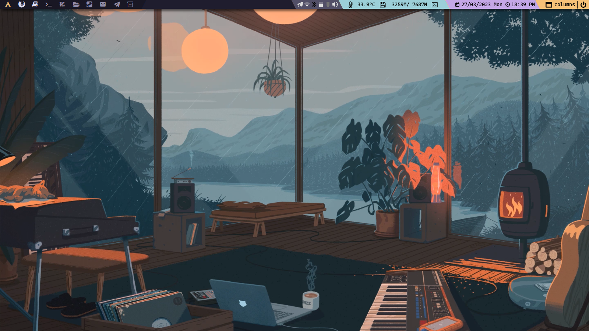
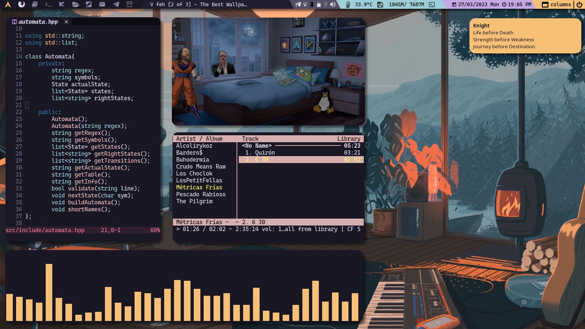

# Gerar's Dotfiles
This is the site where I save all the configurations of the programs I use.
Also is where I save my rices.

**In this moment, I'm Using [Rosé Pine](https://github.com/rose-pine/rose-pine-theme) Color Scheme**

## Screenshots

## Dependencies
Programs needed to put it to work.
**Command to Install them on Arch**
~~~ bash
sudo pacman -S <dependencies>
~~~    
    
Where the dependencies are:   
~~~
conky
dunst
kitty
firefox
neovim
qtile
ranger
rofi
zathura
zathura-pdf-mupdf
zsh
alsamixer
alsa-utils
brightnessctl
blueberry
bluez
bluez-tools
gnome-screenshot
go
gsimplecal
mpv
network-manager-applet
nodejs
npm
otf-cascadia-code-nerd
playerctl
pulseaudio
pulseaudio-alsa
pulseaudio-bluetooth
python-psutil
ttf-sourcecodepro-nerd
ttf-ubuntu-mono-nerd
ueberzug
~~~
    
With yay you have install:
~~~ bash
picom-tryone-git
cava-git
cmatrix-git
btop-git
xwinwrap-0.9-bin
spicetify
rofi-power-menu-git
~~~
    
Optional things:
~~~
glow
qutebrowser
tmux
clang
pyright
lua-language-server
typescript-language-server
vscode-css-languageserver
vscode-html-languageserver
~~~

## Firefox
On firefox go to `about:config` dir and change `toolkit.legacyUserProfileCustomizations.stylesheets` option to `true`.

## Zsh
To get working Zsh first you need to install [Oh My Zsh](https://ohmyz.sh/). Once you've installed OMZ then you need to install [Powerlevel](https://github.com/romkatv/powerlevel10k#oh-my-zsh), [Autosuggestions](https://github.com/zsh-users/zsh-autosuggestions/blob/master/INSTALL.md#oh-my-zsh) and finally [Highlighting](https://github.com/zsh-users/zsh-autosuggestions/blob/master/INSTALL.md#oh-my-zsh).

## To Do
### Personalizing Applications
- [ ] Qtile
- [x] Zathura
- [x] Dunst
- [ ] Nvim
- [x] Ranger
- [x] Kitty
- [ ] Rofi
- [x] Firefox
- [ ] Qutebrowser
- [x] Picom
- [ ] Conky
- [x] Zsh
- [ ] Tmux
- [x] Wallpapers
- [ ] Miscelaneous Configurations

### General
- [ ] Explain Configuration
